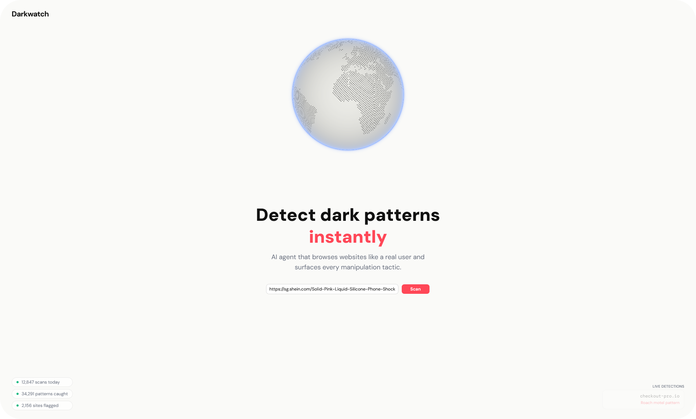
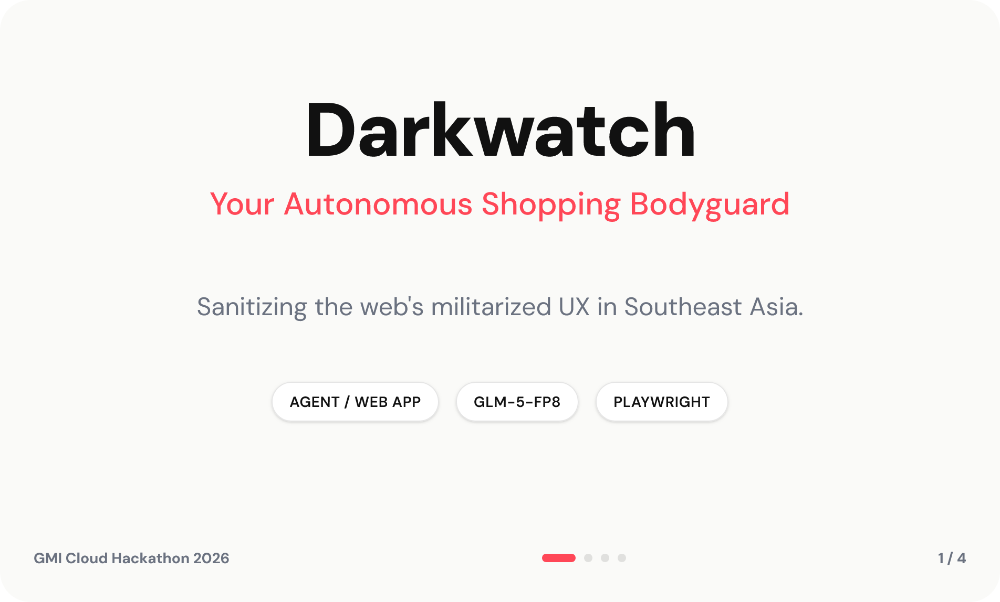
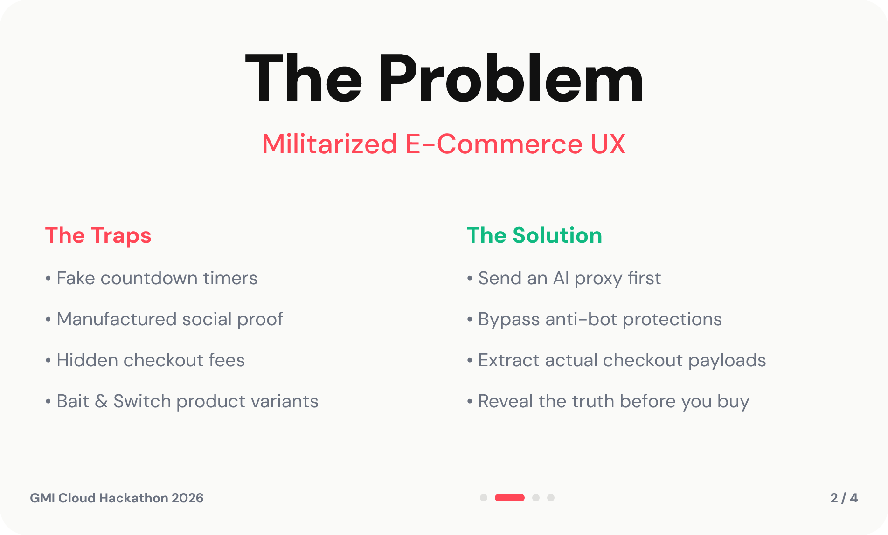
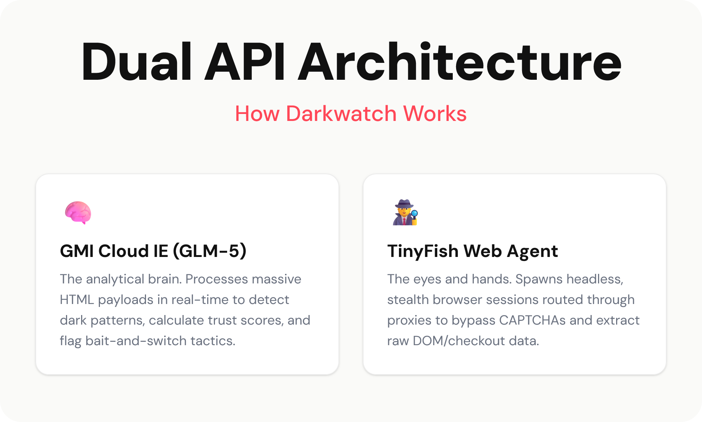

<div align="center"> <!-- use align as CSS is not allowed on GitHub markdown https://github.com/orgs/community/discussions/22728 -->
   <!-- Logo -->
  <h1>Darkwatch</h1> <!-- Project Name -->
  <p> <!-- Description -->
    AI-powered autonomous shopping proxy exposing e-commerce bait-and-switch tactics and deceptive patterns in real time.
  </p>
  <p> <!-- Built With -->
    Built With: Next.js &bull; Tailwind CSS &bull; GMI Cloud (GLM-5-FP8) &bull; TinyFish &bull; Framer Motion
  </p>
</div>

---

<details>
<summary>Table of Contents</summary>

- [About](#about)
- [Demo](#demo)
- [Getting Started](#getting-started)
  - [Prerequisites](#prerequisites)
  - [Installation](#installation)
  - [Execution](#execution)
- [Usage](#usage)
- [Roadmap](#roadmap)
- [Changelog](#changelog)
</details>

## About

**Darkwatch** is an "Autonomous Shopping Bodyguard" built for the Next.js/TinyFish/GLM-5 Hackathon. It specializes in "Hidden Variant Detection"—exposing bait-and-switch scenarios where a listing advertises a high-quality product (e.g., a premium pink phone case) but defaults to a cheaper, inferior variant (e.g., a yellowing white case) in the checkout payload.

By leveraging **TinyFish** for robust, CAPTCHA-bypassing web scraping and **GMI Cloud's GLM-5-FP8 model** for deep semantic analysis of reviews and product payloads, Darkwatch automatically scans product links and visualizes deceptive tactics before the user makes a purchase.

## Demo

<div align="center">
  
  <br><br>
  
  <br><br>
  
</div>

## Getting Started

### Prerequisites

- [Bun](https://bun.sh/) (or Node.js v18+)
- API Keys:
  - GMI Cloud API Key
  - TinyFish API Key

### Installation

Clone the repository and install dependencies:

```bash
git clone https://github.com/yourusername/darkwatch.git
cd darkwatch
bun install
```

Set up your environment variables:

```bash
cp .env.example .env.local
```

Add your `GMI_API_KEY` and `TINYFISH_API_KEY` to the `.env.local` file.

### Execution

Start the Next.js development server:

```bash
bun dev
```

Open [http://localhost:3000](http://localhost:3000) with your browser to see the result.

## Usage

1. Paste a suspected e-commerce product URL into the Darkwatch scanning bar (e.g. `shein.com`).
2. The system initiates an autonomous TinyFish agent to navigate the site, bypass CAPTCHAs via stealth profiles, and extract the real checkout payload and hidden reviews.
3. GMI Cloud's AI analyzes the extracted data to identify bait-and-switch tactics.
4. Review the generated report, utilizing the interactive lightbox to examine evidence screenshots and variant mismatches.

## Roadmap

- [x] Initial hackathon prototype (Next.js + TinyFish + GMI Cloud)
- [x] Implement global image lightbox for evidence review
- [x] Bypass complex slider CAPTCHAs with stealth navigation
- [ ] Develop a browser extension for real-time shopping protection
- [ ] Expand supported e-commerce platforms (Amazon, Temu, AliExpress)
- [ ] Real-time community reporting dashboard

## Changelog

See [CHANGELOG](CHANGELOG.md) for details.

## License <!-- omit in toc -->

Distributed under the MIT License.

## Credits <!-- omit in toc -->

- Built for the Next.js/TinyFish/GLM-5 Hackathon.

## Acknowledgements <!-- omit in toc -->

<!-- Inspired by Best-README-Template (https://github.com/othneildrew/Best-README-Template) -->
<!-- Table of Contents generated by Markdown All in One (https://github.com/yzhang-gh/vscode-markdown) -->
